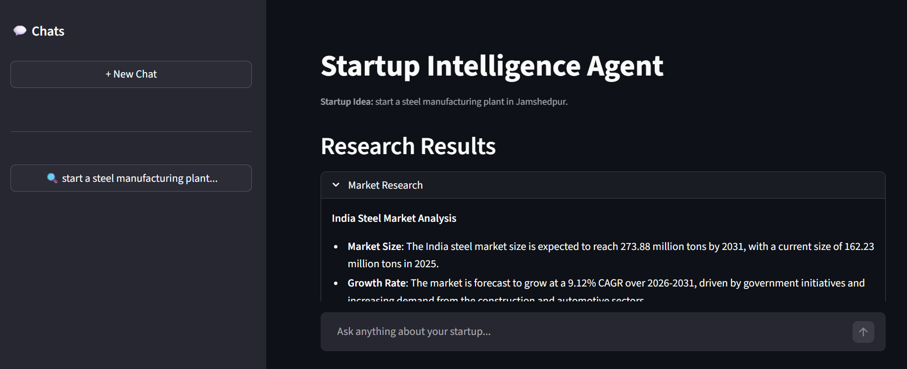
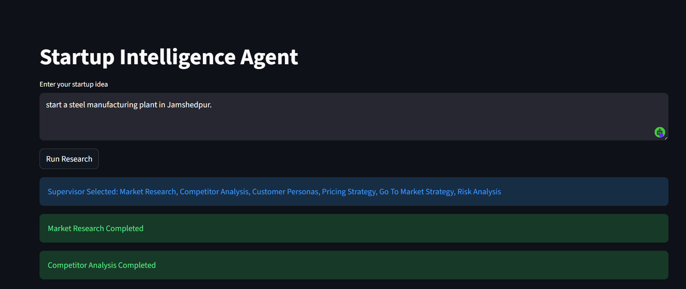
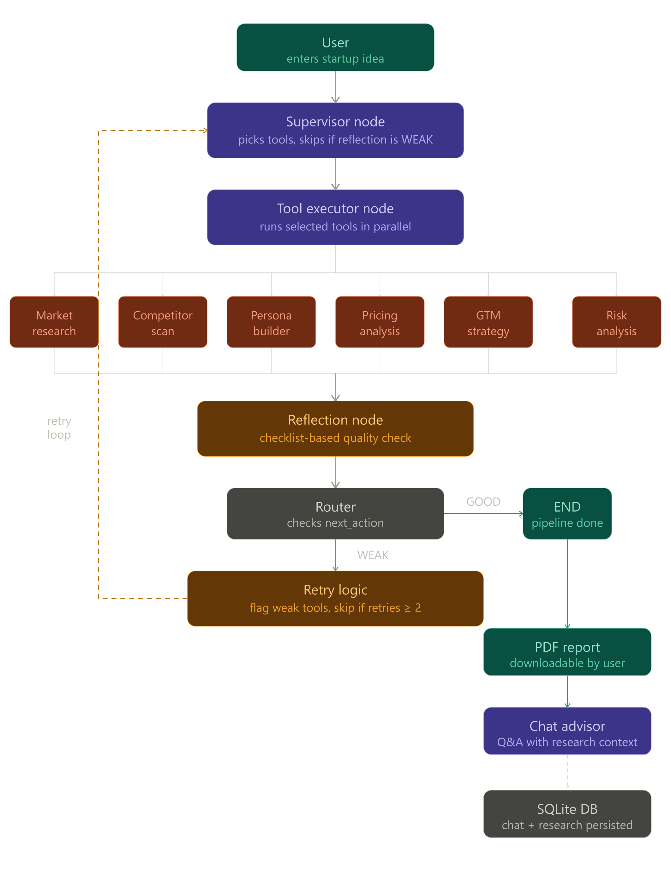

<div align="center">

# 🚀 Startup Intelligence Agent

### AI-powered startup analysis using autonomous agents

[](https://python.org)
[](https://streamlit.io)
[](https://langchain-ai.github.io/langgraph/)
[](https://groq.com)
[](https://tavily.com)
[](LICENSE)

[Live Demo](https://startup-analyser.streamlit.app) • [Report Bug](https://github.com/harsimar-singh03/startup-analyser/issues) • [Request Feature](https://github.com/harsimar-singh03/startup-analyser/issues)

</div>

---

## 📸 Interface

<p align="center">
  
  &nbsp;
  
</p>

---

## 📄 Sample Report

👉 [Click here to view a sample generated PDF report](report.pdf)

The report is auto-generated after all 6 research agents complete. It includes market research, competitor analysis, customer personas, pricing strategy, GTM plan, and risk analysis — all in a clean downloadable PDF.

---

## 🧠 How It Works — Agent Workflow



The app uses a **multi-agent LangGraph pipeline** that runs autonomously:

1. **Supervisor Node** — decides which tools to run next based on what's already been completed
2. **Tool Executor Node** — runs selected tools in parallel using `asyncio`
3. **Reflection Node** — evaluates output quality and flags weak results for retry
4. **Router** — if reflection says `WEAK`, only the weak tools are re-run (max 2 retries each). If `GOOD`, the pipeline ends and a PDF report is generated.

---

## ✨ Features

- 🔍 **Market Research** — market size, growth rate, trends, opportunities
- 🏆 **Competitor Analysis** — top competitors, strengths, weaknesses, market gaps (powered by Tavily web search)
- 👥 **Customer Personas** — 3 realistic personas with goals, frustrations, spending behavior
- 💰 **Pricing Strategy** — pricing model, tiers, and monetization advice
- 📣 **Go-To-Market Strategy** — target audience, channels, 90-day launch plan
- ⚠️ **Risk Analysis** — business, financial, operational, market, and competition risks
- 📄 **PDF Report** — downloadable professional report with all research
- 💬 **Chat Advisor** — ask follow-up questions using the research as context
- 🔄 **Persistent Chat History** — chat survives page refresh, stored in SQLite
- 🧵 **Multi-thread Chats** — start new chats, switch between past startup analyses from the sidebar

---

## 🗂️ Project Structure

```
startup-analyser/
│
├── app.py                        # Main Streamlit app
├── graph.py                      # LangGraph pipeline definition
├── state.py                      # Shared state (TypedDict)
│
├── nodes/
│   ├── supervisor_node.py        # Decides which tools to run
│   ├── tool_executor_node.py     # Runs tools in parallel
│   ├── reflection_node.py        # Evaluates output quality
│   └── chat_node.py              # Handles follow-up chat
│
├── tools/
│   ├── market_tool.py            # Market research (Tavily + LLM)
│   ├── competitor_tool.py        # Competitor scan (Tavily + LLM)
│   ├── persona_tool.py           # Customer persona builder
│   ├── pricing_tool.py           # Pricing strategy generator
│   ├── gtm_tool.py               # Go-to-market strategy
│   ├── risk_tool.py              # Risk analysis
│   └── tool_registry.py          # Tool name → function mapping
│
└── utils/
    ├── groq_client.py            # Groq LLM client setup
    ├── report_generator.py       # PDF report generator (ReportLab)
    ├── tool_names.py             # Display name mapping
    └── db.py                     # SQLite chat + research persistence
```

---

## ⚙️ Setup & Installation

### 1. Clone the repository

```bash
git clone https://github.com/harsimar-singh03/startup-analyser.git
cd startup-analyser
```

### 2. Create and activate a virtual environment

```bash
# Windows
python -m venv venv
venv\Scripts\activate

# Mac / Linux
python -m venv venv
source venv/bin/activate
```

### 3. Install dependencies

```bash
pip install -r requirements.txt
```

### 4. Create your `.env` file

Create a file named `.env` in the root of the project and add the following:

```env
GROQ_API_KEY=your_groq_api_key_here
TAVILY_API_KEY=your_tavily_api_key_here
```

| Variable | Where to get it | Used for |
|---|---|---|
| `GROQ_API_KEY` | [console.groq.com](https://console.groq.com) | LLM calls (LLaMA 3.3 70B) |
| `TAVILY_API_KEY` | [app.tavily.com](https://app.tavily.com) | Web search for market & competitor tools |

> ⚠️ Never commit your `.env` file to GitHub. It is already listed in `.gitignore`.

### 5. Run the app

```bash
streamlit run app.py
```

The app will open at `http://localhost:8501`

---

## 📦 Requirements

```
streamlit
langgraph
langchain-groq
tavily-python
reportlab
python-dotenv
```

Install all at once:

```bash
pip install -r requirements.txt
```

---

## 🌐 Deploying to Streamlit Cloud

1. Push your project to GitHub (make sure `.env` is in `.gitignore`)
2. Go to [share.streamlit.io](https://share.streamlit.io)
3. Click **New App** → select your repo → set main file as `app.py`
4. Click **Advanced Settings** → add your secrets:

```toml
GROQ_API_KEY = "your_groq_api_key_here"
TAVILY_API_KEY = "your_tavily_api_key_here"
```

5. Click **Deploy** ✅

---

## 🔄 Agent Pipeline — Detailed Flow

```
User enters startup idea
        ↓
   Supervisor Node
   (picks 2 tools to run)
        ↓
  Tool Executor Node
  (runs tools in parallel)
        ↓
   Reflection Node
   (checks output quality)
        ↓
   WEAK? → re-run only weak tools (max 2 retries each)
   GOOD? → generate PDF report → open chat
```

The reflection node uses a **checklist-based prompt** to evaluate each tool:

| Tool | Must contain |
|---|---|
| Market Research | market size, growth rate, trends |
| Competitor Analysis | competitor names, strengths, weaknesses |
| Customer Personas | 3 personas, age, goals, frustrations |
| Pricing Strategy | pricing model, tiers, prices |
| GTM Strategy | target audience, channels, 90-day plan |
| Risk Analysis | risk types, mitigation strategies |

---

## 🛠️ Tech Stack

| Technology | Purpose |
|---|---|
| [Streamlit](https://streamlit.io) | Frontend UI |
| [LangGraph](https://langchain-ai.github.io/langgraph/) | Multi-agent pipeline orchestration |
| [Groq + LLaMA 3.3 70B](https://groq.com) | LLM for all AI reasoning |
| [Tavily](https://tavily.com) | Real-time web search |
| [ReportLab](https://www.reportlab.com) | PDF report generation |
| [SQLite](https://sqlite.org) | Chat and research persistence |
| Python asyncio | Parallel tool execution |

---

## 📄 License

This project is licensed under the MIT License. See the [LICENSE](LICENSE) file for details.

---

<div align="center">

Made by [Harsimar Singh](https://github.com/harsimar-singh03)

⭐ Star this repo if you found it useful!

</div>
